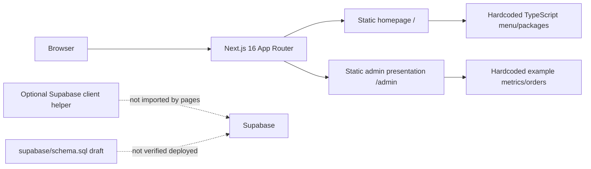

# Architecture

**Snapshot:** 2026-10-09. Actual source inspected at repository HEAD `d6cfff2`; live deployment and external services were not inspected.

## Implemented architecture

The app source is in `frontend/src/app/`, not the layout proposed by `specs/001-umodai-restaurant/plan.md`. Only `/` and `/admin` are implemented. No API routes, server actions, auth routes, payment provider, or data access workflows were found. `supabase/schema.sql` contains eight tables and RLS policies but is not a migration sequence; no deployed state is known.

## Critical authorization limitation

Policies for sensitive records currently allow any authenticated user. They do not check administrator membership, role, activation, or ownership. Do not deploy this schema for real customer or financial data. The separate admin page is also not protected by application auth.

## Intended architecture (not yet implemented)

The Umodai PRD and plan propose bilingual customer flows, staff-reviewed catering, Supabase as the operational database, verified provider callbacks, auditability, payments and commission attribution. The plan does not constitute evidence of these modules. Payment provider, commission basis, roles and several operational details remain decisions. Keep provider/payment design on paper until security and business invariants are approved.

## PRD Maker source

`docs/source/PRD_MAKER_ORIGINAL.md` describes a prompt-driven PRD creation workflow. It is a separate assistant specification and has no implementation architecture in this repository.
